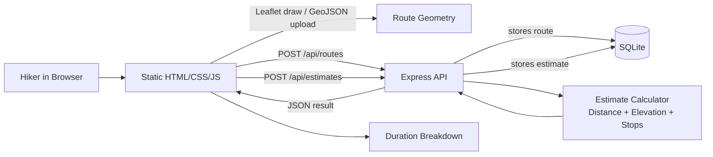

# Trail Timer

A tiny web app that helps hikers estimate trip duration from a drawn or uploaded route. Draw a line on the map (or upload GeoJSON), enter pace/elevation/stops, and get an instant estimate with a breakdown.

## Architecture



## What works in this MVP

- Draw a hiking route on an interactive map.
- Upload a `.geojson` file containing a `LineString`, `MultiLineString`, or feature collection.
- Automatically calculate route distance using the Haversine formula.
- Enter route name, hiking pace, elevation gain, and stop minutes.
- Receive a saved estimate with:
  - base walking time
  - elevation penalty
  - stop penalty
  - total duration
- View recently saved routes and estimates.

## Run instructions

Requirements: Node.js 18+

```bash
npm install
npm run dev
```

Then open:

```text
http://localhost:3000
```

For a production-style local run:

```bash
npm run build
npm start
```

## Environment variables

Copy `.env.example` to `.env` if you want to customize settings.

| Variable | Default | Description |
| --- | --- | --- |
| `PORT` | `3000` | HTTP server port. |
| `DATABASE_PATH` | `./data/trail_timer.sqlite` | SQLite database file location. |

No external API keys are required.

## Estimate formula

```text
base time = distanceKm * paceMinPerKm
elevation penalty = elevationGainM / 100 * 10 minutes
stop penalty = stopMinutes
total = base time + elevation penalty + stop penalty
```

The elevation penalty is intentionally simple for the MVP: every 100m of ascent adds 10 minutes.

## Try the seed route

On first run, the app creates a small sample route named `Sample Ridge Walk` so the recent routes list is not empty.
